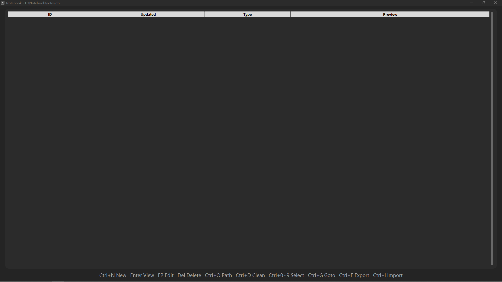

# Notebook

A lightweight note-taking app built with Python and CustomTkinter.

## Features

- SQLite storage (fast, safe, no file corruption)
- Permanent / temporary notes
- Real-time search with Regex support
- Fullscreen mode
- Customizable theme, font size, and colors
- Import / Export (JSON, CSV)
- Keyboard-driven UI
- Dark / Light / System theme

## Shortcuts

| Key | Action |
|-----|--------|
| Ctrl+N | New note |
| Enter | View |
| F2 | Edit |
| Del | Delete |
| Ctrl+F | Search |
| Ctrl+S | Settings |
| F11 | Toggle fullscreen |
| Ctrl+O | Change folder |
| Ctrl+D | Clean temp notes |
| Ctrl+0~9 | Select note 1-10 |
| Ctrl+G | Goto note by ID |
| Ctrl+E | Export |
| Ctrl+I | Import |
| Esc | Close search / Exit |

## Requirements

- Python 3.10+
- customtkinter

## Install

pip install customtkinter

## Run

python "Notebook.py"

## Build exe

pyinstaller --onefile --noconsole --icon="icon.ico" --add-data "icon.ico;." --collect-all customtkinter "Notebook.py"

## Changelog

### v1.1
- Added real-time search with Regex support (Ctrl+F)
- Added fullscreen mode (F11)
- Added settings panel: theme, font size, text color, highlight color (Ctrl+S)
- Fixed crash when changing folder
- Fixed crash when closing Settings dialog

### v1.0
- Initial release
- SQLite storage
- Permanent / temporary notes
- Import / Export (JSON, CSV)
- Keyboard-driven UI

## License

AGPL-3.0